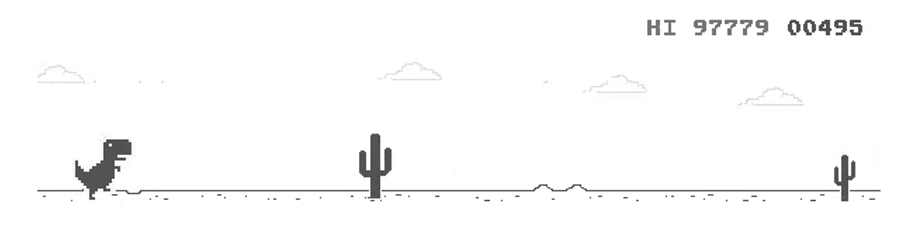

# AI T-Rex Runner

Group 12


## Best Score



## Main Idea and Method

By applying Deep Reinforcement Learning to the game.

Using OpenAI Gym - an easy-to-setup intelligence benchmark with a wide variety of different environments. It can make a simple interface with all users. It requires a graphics display as well. In this project, we use the ChromeDino library and aim to train 1000000 times. 

During the training, the T-Rex will make different actions (jump/ no jump/ duck) to avoid the obstacle. The goal is to make sure T-Rex can reach the max point set in the coed without hitting any obstacle. The score will be the time that the T-Rex survive

## Original and Improved models

After decreasing environment size for the AI to train, we still needed faster convergence. So, we set up extra rewards for each action the t-rex takes.

Two new input variables:
boolean to tell if there is an obstacle
done to tell us if the dinosaur has died

Reward updates:
+100 reward is added to the replay queue when t-rex jumps over an obstacle
+5 reward when t-rex does not jump and there is no obstacle
-100 reward if dinosaur jumps randomly (no obstacle is jumped over)
-1000 reward when dinosaur runs into an obstacle whether it jumps or not

## Run Application

Complete Installation Guide
- [INSTALL.md](INSTALL.md)

## Status Update

[Link to Google Slides](https://docs.google.com/presentation/d/1yOmbdMKvYfRc3cbZBhmAUroexrwRaavnGbD6f3xCVzE/edit?usp=sharing)

## Clone Repo

```shell
git clone https://github.com/AIFictionFact/Projects_2021_G12-AI-in-T-rex-runner.git
```

## Contact

If you have any questions, sent email to

```shell
AIiFF.AIREX@gmail.com
```

## License

[MIT License](LICENSE)

## Reference

[T-Rex Runner Gym for Q-Learning](https://github.com/elvisyjlin/gym-chrome-dino)

[Reinforcement Learning for Mountain Car](https://geektutu.com/post/tensorflow2-gym-dqn.html)

